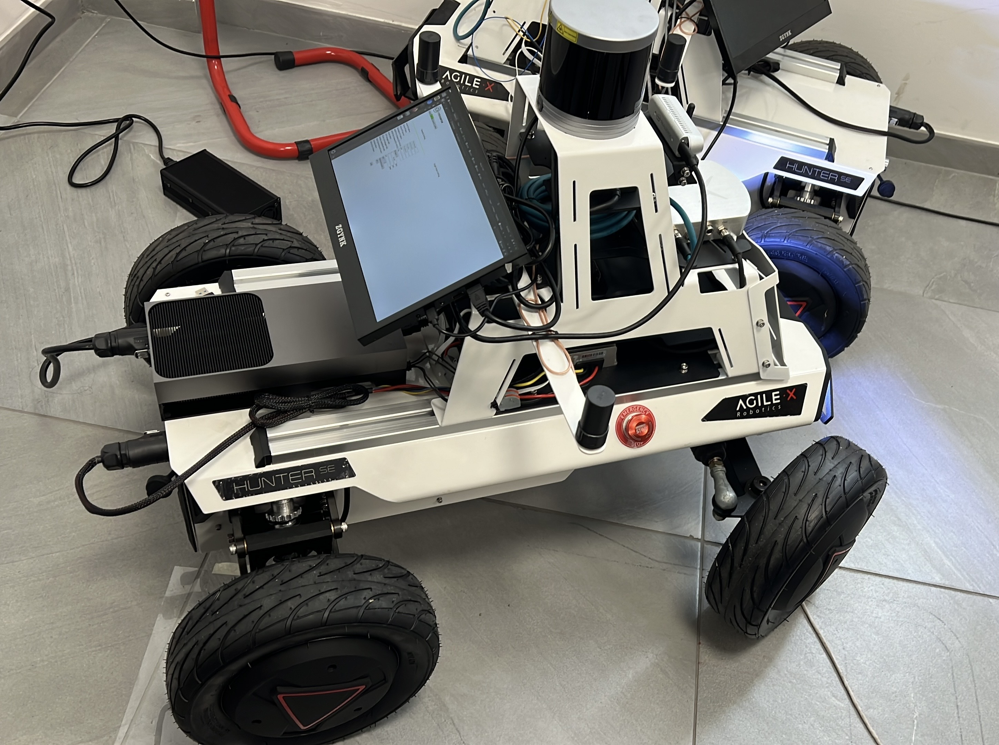

# LVI-SAM

A ROS2 repo of LiDAR-Visual-Inertial system intended for GNSS denied applications. LVI-SAM original repository was based on ROS1 and older ubuntu versions also have issues with calibration parameters of the sensor that lack adaptability. All those problems are now fixed in this repository along with migration on the latest ROS2 Jazzy and Ubuntu 24.

<p align='center'>
    
</p>

---

## Dependency

- [ROS 2](https://docs.ros.org/en/jazzy/Installation.html) (Tested with ROS 2 Jazzy on Ubuntu 24.04 ARM64)

- [Eigen 3.4.0](C++ template library for linear algebra)
  ```bash
  wget -O ~/Downloads/eigen-3.4.0.tar.gz [https://gitlab.com/libeigen/eigen/-/archive/3.4.0/eigen-3.4.0.tar.gz](https://gitlab.com/libeigen/eigen/-/archive/3.4.0/eigen-3.4.0.tar.gz)
  cd ~/Downloads/ && tar -xzf eigen-3.4.0.tar.gz
  cd eigen-3.4.0
  mkdir build && cd build
  cmake ..
  sudo make install
  ```
- [OpenCV 4.8.0] (Computer Vision library)

  ```
    sudo apt-get install libopencv-dev
  
  ```
- [PCL 1.14.0] (Point Cloud Library)

---

## Compile

You can use the following commands to download and compile the package.

```
cd ~/ros2ws/src
git clone <ProjectURL>
cd ..
colcon build --packages-select lvi_sam --cmake-args -DCMAKE_BUILD_TYPE=Release
```

---
If you are experiencing a freeze on your PC, you can use -j2 or -j4 parallel workers.
## Datasets

<p align='center'>
    
</p>

The data-gathering sensor suite includes: Robosense Helio-16 lidar, Fixposition Vision RTK2 for IMU and Monocular Camera.


<p align='center'>
    
    
</p>

---

## Run the package

1. Configure parameters:

```
Configure sensor parameters in the .yaml files in the ```config``` folder.
```

2. Run the launch file:
```
roslaunch lvi_sam run.launch
```

3. Play existing bag files:
```
rosbag play handheld.bag 
```

---

## TODO

  - [ ] Update graph optimization using all three factors in imuPreintegration.cpp, simplify mapOptimization.cpp, increase system stability 

---

## Paper 

Thank you for citing our [paper](./doc/paper.pdf) if you use any of this code or datasets.

```
@inproceedings{lvisam2021shan,
  title={LVI-SAM: Tightly-coupled Lidar-Visual-Inertial Odometry via Smoothing and Mapping},
  author={Shan, Tixiao and Englot, Brendan and Ratti, Carlo and Rus Daniela},
  booktitle={IEEE International Conference on Robotics and Automation (ICRA)},
  pages={to-be-added},
  year={2021},
  organization={IEEE}
}
```

---

## Acknowledgement

  - The visual-inertial odometry module is adapted from [Vins-Mono](https://github.com/HKUST-Aerial-Robotics/VINS-Mono).
  - The lidar-inertial odometry module is adapted from [LIO-SAM](https://github.com/TixiaoShan/LIO-SAM/tree/a246c960e3fca52b989abf888c8cf1fae25b7c25).
